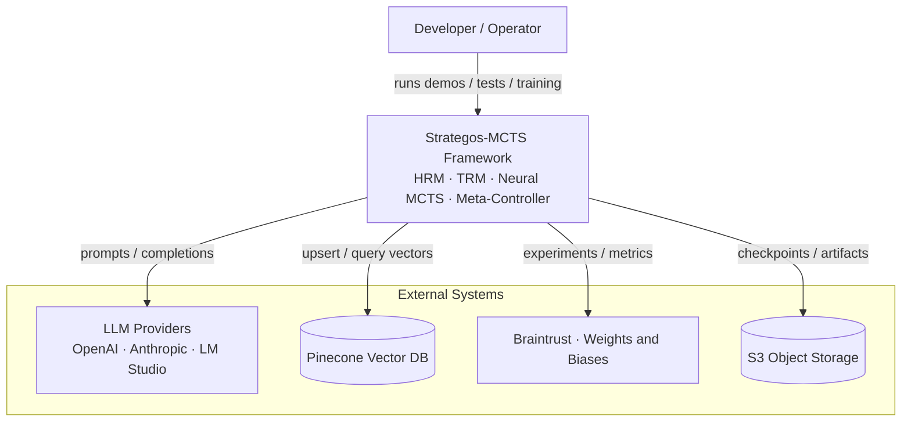

# Strategos-MCTS

**A LangGraph multi-agent Neural MCTS / AlphaZero self-play framework** — production-quality components for
a DeepMind-style AI system with Neural MCTS and Hierarchical Reasoning (pre-integration — see
[Known Limitations](#-known-limitations)). Distributed on PyPI as `langgraph-multi-agent-mcts`.

[](https://github.com/ianshank/Strategos-MCTS/actions/workflows/ci.yml)
[](docs/STATUS.md)
[](LICENSE)
[](pyproject.toml)
[](pyproject.toml)
[](pyproject.toml)

This framework implements a multi-agent system combining hierarchical reasoning (HRM), iterative refinement (TRM), and Monte Carlo Tree Search (MCTS) guided by neural networks. It features a training pipeline, synthetic data generation, and RAG integration. The individual components are well-tested and engineered to a production standard; full end-to-end integration is still in progress.



> Full C4 architecture diagrams: [`docs/C4_ARCHITECTURE.md`](docs/C4_ARCHITECTURE.md) · rendered gallery in
> [`docs/diagrams/`](docs/diagrams/).

## Table of Contents

- [Known Limitations](#-known-limitations)
- [Key Features](#-key-features)
- [Installation](#-installation)
- [Training Workflow](#-training-workflow)
- [Testing](#-testing)
- [Documentation](#-documentation)
- [Security](#-security)
- [Support](#-support)
- [Contributing](#-contributing)
- [License](#-license)

## ⚠️ Known Limitations

- **Mock/lightweight fallbacks are opt-in.** When the configured LLM or the full integrated
  framework can't initialize, the service fails loud by default rather than silently serving
  mock output. Enable `ALLOW_MOCK_LLM_FALLBACK` / `ALLOW_LIGHTWEIGHT_FRAMEWORK_FALLBACK` for
  tests/dev (see `.env.example`).
- **Persisted artifacts changed format.** The substructure library now persists as JSON and
  the experience buffer via `torch.save(weights_only=True)`. Legacy `pickle` files are only
  read when `ASSEMBLY_TRUST_LEGACY_PICKLE` / `TRAINING_TRUST_LEGACY_PICKLE` are set, then
  migrated in place. See [CHANGELOG.md](CHANGELOG.md).
- **Some training and hybrid-agent paths are extension points.** Domain-specific prompt/parse
  logic and certain training loops ship as overridable defaults, not finished implementations.
- See **[`docs/STATUS.md`](docs/STATUS.md)** for the current, reproducible test/coverage status
  (the source of truth) and **[`docs/NEXT_STEPS_IMPLEMENTATION_PLAN_2026H2.md`](docs/NEXT_STEPS_IMPLEMENTATION_PLAN_2026H2.md)**
  for the active roadmap. (`docs/reports/GAP_ANALYSIS_REPORT.md` is retained for history but superseded.)

## 🚀 Key Features

### 🧠 Core Architecture
- **HRM (Hierarchical Reasoning Module)**: DeBERTa-based agent for complex problem decomposition.
- **TRM (Task Refinement Module)**: Iterative agent for refining and optimizing solutions.
- **Neural MCTS**: AlphaZero-style tree search guided by policy/value networks.
- **Meta-Controller**: Neural router (GRU/BERT) that dynamically assigns tasks to the best agent.
- **Deep Research Agent Swarm (`/deep-research`)**: Multi-agent literature discovery and architectural feasibility pipeline (Planner -> Fetcher -> Critic -> Synthesizer).

### 🛠️ Training Pipeline & Scaling
- **Multi-GPU Distributed Training**: PyTorch DistributedDataParallel (`src/utils/distributed.py`) via `torchrun` with Rank-0 I/O fencing.
- **End-to-End Orchestration**: Automated multi-stage training (Pre-training → Fine-tuning → Self-Play).
- **Synthetic Data Generation**: LLM-powered generator for creating high-quality training datasets.
- **Research Corpus Builder**: Automated fetching and indexing of arXiv papers for RAG.
- **Docker Support**: Fully containerized training and inference environments.

### 📊 Observability & RAG
- **RAG Integration**: Pinecone vector database for retrieving domain knowledge.
- **Experiment Tracking**: Full integration with Weights & Biases.
- **Production Monitoring**: Prometheus/Grafana metrics for latency, memory, and model performance.

### 🔌 Serving, Streaming & Visualization
- **Streaming**: token/node-level LangGraph event streaming (`/query-stream`, SSE) via `src/api/streaming.py`.
- **Graph visualization**: structure / Mermaid / Kroki render (`/graph/*`) via `src/api/graph_service.py`.
- **MCTS vs single-shot comparison**: `/compare` + `demo.py --compare` + Gradio UI (`app.py`, `[ui]` extra).
- All gated by settings flags (`ENABLE_STREAMING` / `ENABLE_GRAPH_VISUALIZATION` / `ENABLE_DEMO_COMPARISON`).

### 🔁 Neural Self-Play & Fast Gameplay (M5+)
- **Generalized `SelfPlayTrainer`** (`src/training/self_play_trainer.py`) supporting DistributedDataParallel (DDP), FP16 mixed precision, `torch.compile`, pinned memory, and non-pickle checkpoint sidecars.
- **Fast Gameplay Domains** (`docs/GAME_DOMAINS.md`): Connect Four (`src/games/connect_four/`), Othello / Reversi (`src/games/othello/`), Chess, and single-agent reasoning/planning domains with zero required C dependencies.
- **GPU Hardware Introspection** (`docs/GPU_TRAINING_GUIDE.md`): `src/utils/gpu_utils.py` for pre-flight memory validation, `GPUMemoryTracker`, and CUDA allocation fraction enforcement.
- **Operational Training Profiles**: `--profile {smoke,dev,full}` presets for instant plumbing validation, dev testing, and full self-play training.
- **Policy-comparison benchmark** (`src/benchmark/policy_comparison.py`) with a domain-type-aware decision-quality lift metric and a **meta-controller learning loop** (`docs/META_CONTROLLER_TRAINING.md`).


## 📦 Installation

### Prerequisites
- Python 3.10+ (3.11+ recommended)
- Docker & Docker Compose (for containerized workflow)
- NVIDIA GPU (recommended for training)

### Quick Start

1. **Clone the repository:**
   ```bash
   git clone https://github.com/ianshank/Strategos-MCTS.git
   cd Strategos-MCTS
   ```

2. **Set up environment variables:**
   ```bash
   cp .env.example .env
   # Edit .env with your API keys (OpenAI, Pinecone, W&B)
   ```

3. **Run with Docker (Recommended):**
   ```bash
   # Run the demo pipeline (builds image, generates data, trains models)
   bash scripts/run_docker_training.sh
   ```

4. **Run Locally (No Docker):**
   See **[`docs/RUN_ALL_LOCALLY.md`](docs/RUN_ALL_LOCALLY.md)** for detailed instructions and PowerShell scripts (`scripts/run_all_local.ps1`) to run the entire framework directly on Windows or macOS.

## 🏗️ Training Workflow

The framework supports a comprehensive training lifecycle:

1.  **Data Generation**:
    ```bash
    # Generate synthetic Q&A pairs
    python -m scripts.generate_synthetic_training_data --num-samples 1000
    ```

2.  **Corpus Building**:
    ```bash
    # Fetch and index arXiv papers
    python -m training.examples.build_arxiv_corpus --mode keywords --max-papers 200
    ```

3.  **Production Training**:
    ```bash
    # Run full training pipeline
    bash scripts/run_production_training.sh
    ```

## 🧪 Testing

Run the comprehensive test suite to verify system integrity:

```bash
# Run all tests
pytest tests/

# Run integration tests
pytest tests/integration/

# Run specific deployed model tests
pytest tests/integration/test_deployed_models.py
```

### Continuous integration & quality gates

To reproduce CI locally, install with the same extras CI uses and run the unit suite with
the coverage gate:

```bash
pip install -e ".[dev,neural]"
ruff check src/ tests/ && black src/ tests/ --check --line-length 120 && mypy src/
pytest tests/unit/ --cov=src --cov-fail-under=85
```

The CI pipeline enforces an **85% coverage gate** and pins `ruff`/`mypy` (in the `[dev]`
extra, installed by the lint job) so local and CI runs use identical tool versions.

### API authentication

The REST API selects its auth scheme via `AUTH_MODE` (Pydantic Settings):

- `api_key` (default): `X-API-Key` header validated against the API-key authenticator — unchanged
  behavior.
- `jwt`: the header carries a JWT validated against `JWT_SECRET` / `JWT_ALGORITHM` / `JWT_EXPIRY_HOURS`.
  `JWT_SECRET` is required at startup in this mode (the server fails fast otherwise).

Secrets are never committed: Kubernetes pulls them via the External Secrets Operator — see
[`docs/SECRETS_MANAGEMENT.md`](docs/SECRETS_MANAGEMENT.md).

### Spec-driven development

Phase work is specified as `specs/*.SPEC.md` (Goal / Acceptance Criteria / Constraints) validated by
the harness (`harness validate-spec specs/<file>.SPEC.md`) and a CI `spec-validate` job. Reusable
helper skills live in `.claude/skills/` (`quality-gate`, `validate-specs`, `coverage-baseline`,
`strategos-primer` for codebase orientation, and `validate-context`, which deterministically checks
the `.claude/` skills/agents against the tree). The `strategos-guide` agent (`.claude/agents/`) is the
dispatchable counterpart of the primer. See `AGENTS.md` for the agent routing ledger.

## 📚 Documentation

- **[Documentation Index](docs/README.md)**: Start here — the full map of guides, references, and explanations.
- **[Project Status](docs/STATUS.md)**: Reproducible test/coverage baseline (source of truth).
- **[Active Roadmap](docs/NEXT_STEPS_IMPLEMENTATION_PLAN_2026H2.md)**: Current implementation plan.
- **[Architecture Guide](docs/C4_ARCHITECTURE.md)**: Detailed C4 diagrams of system components.
- **[Meta-Controller Training](docs/META_CONTROLLER_TRAINING.md)**: Routing learning loop (M5).
- **[Secrets Management](docs/SECRETS_MANAGEMENT.md)**: External Secrets Operator setup & rotation.
- **[Training Guide](docs/LOCAL_TRAINING_GUIDE.md)**: How to train models locally or in the cloud.
- **[Synthetic Data](training/SYNTHETIC_DATA_GENERATION_GUIDE.md)**: Guide to generating training data.
- **Reference archives**: implementation summaries, analysis reports, historical roadmaps, and quickstarts
  are organized under [`docs/summaries/`](docs/summaries/), [`docs/reports/`](docs/reports/),
  [`docs/plans/`](docs/plans/), and [`docs/quickstart/`](docs/quickstart/) (see
  [`PROJECT_STRUCTURE.md`](PROJECT_STRUCTURE.md)).

## 🔒 Security

Please report vulnerabilities privately — do **not** open a public issue. See our
[Security Policy](.github/SECURITY.md) for the reporting process and supported versions.

## 💬 Support

Need help? See [SUPPORT.md](.github/SUPPORT.md) for where to ask questions and how to file bug reports and
feature requests, and the [Documentation Index](docs/README.md) for guides.

## 🤝 Contributing

Contributions are welcome! Please read our [Contributing Guide](.github/CONTRIBUTING.md) for the development
environment, the quality gate, and the spec-driven development workflow. All participants are expected to
follow our [Code of Conduct](.github/CODE_OF_CONDUCT.md).

## 📜 License

MIT License - see the [LICENSE](LICENSE) file for details.
