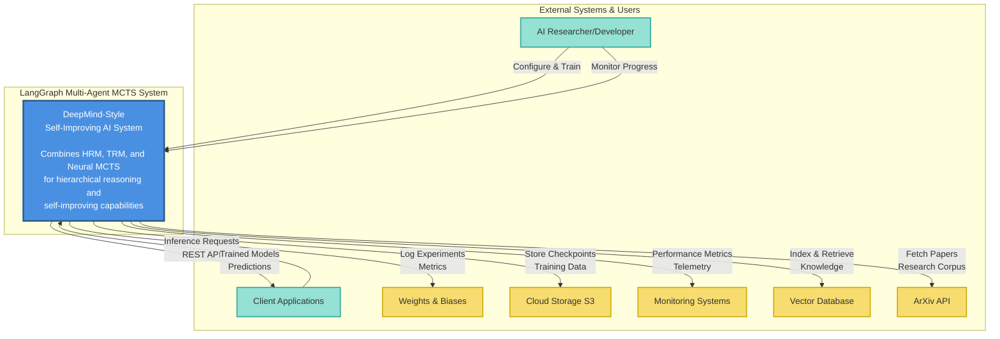
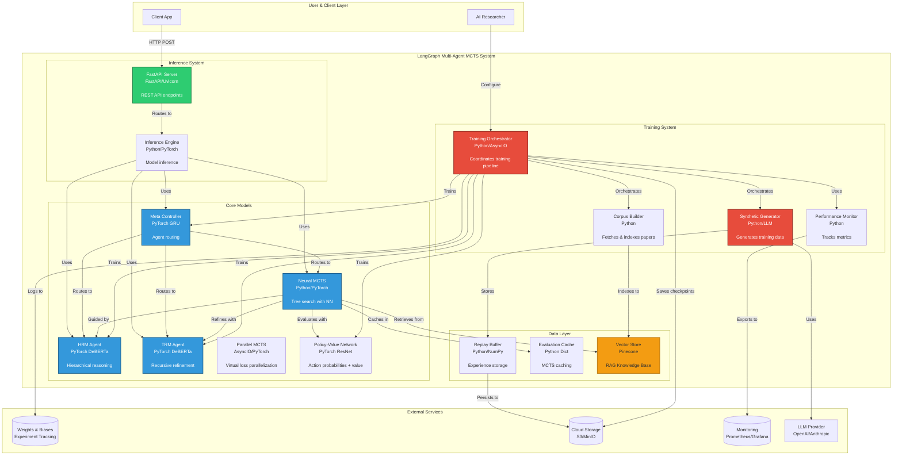
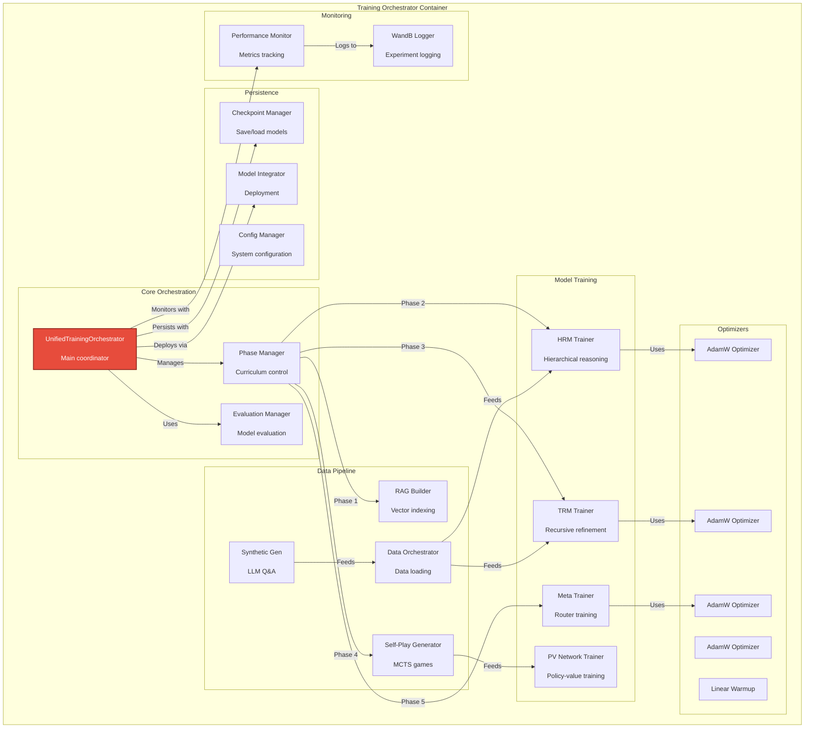
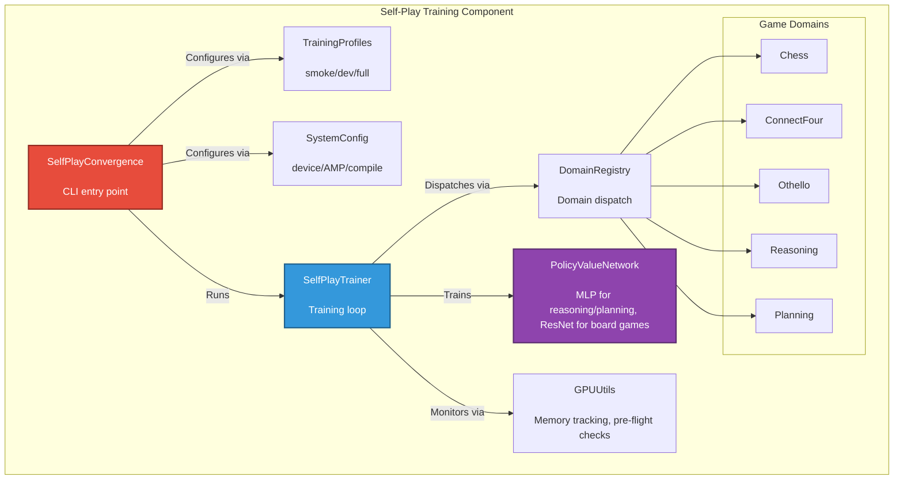
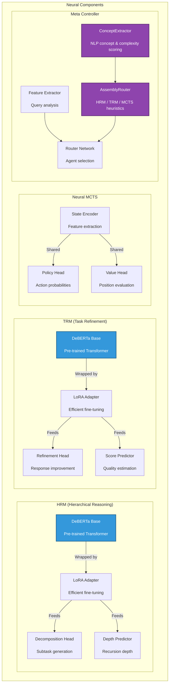
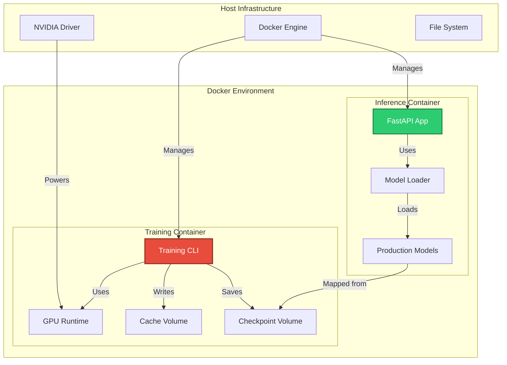
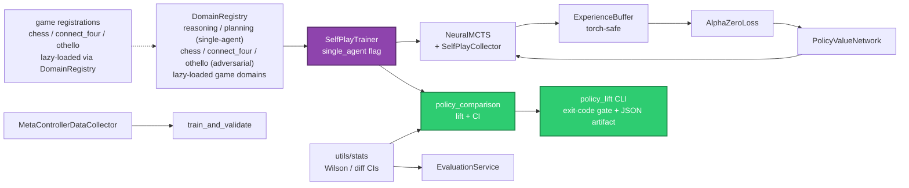

# C4 Architecture Diagrams: DeepMind-Style Self-Improving AI System

This document provides C4 architecture diagrams (Context, Container, Component, and Code levels) for the LangGraph Multi-Agent MCTS framework with DeepMind-style learning.

## Table of Contents

1. [Level 1: System Context Diagram](#level-1-system-context-diagram)
2. [Level 2: Container Diagram](#level-2-container-diagram)
3. [Level 3: Component Diagrams](#level-3-component-diagrams)
4. [Level 4: Code Diagrams](#level-4-code-diagrams)
5. [Deployment Architecture](#deployment-architecture)
6. [Data Flow Diagrams](#data-flow-diagrams)

---

## Level 1: System Context Diagram

Shows the system in its environment with external actors and systems.

### Key Relationships

| From | To | Description |
|------|-----|-------------|
| **AI Researcher** | System | Configures training parameters, monitors experiments |
| **Client Applications** | System | Makes inference requests via REST API |
| **System** | Weights & Biases | Logs training metrics, experiments, model performance |
| **System** | Cloud Storage | Persists checkpoints, training data, replay buffer |
| **System** | Monitoring | Sends telemetry, performance metrics, alerts |
| **System** | Pinecone | Stores/Retrieves vector embeddings for RAG |
| **System** | ArXiv API | Fetches research papers for knowledge corpus |

---

## Level 2: Container Diagram

Shows the high-level technical building blocks (applications, data stores, services).

### Container Descriptions

| Container | Technology | Responsibility |
|-----------|-----------|----------------|
| **Training Orchestrator** | Python, PyTorch, AsyncIO | Coordinates complete training pipeline, curriculum learning |
| **Synthetic Generator** | Python, LLM | Generates high-quality Q&A pairs for training |
| **Corpus Builder** | Python | Fetches arXiv papers and builds vector index |
| **HRM Agent** | PyTorch, DeBERTa | Hierarchical problem decomposition |
| **TRM Agent** | PyTorch, DeBERTa | Recursive solution refinement |
| **Neural MCTS** | Python, NumPy, PyTorch | AlphaZero-style tree search with neural guidance |
| **Parallel MCTS** | Python, AsyncIO | Tree-parallel search with virtual-loss collision avoidance |
| **Meta Controller** | PyTorch, GRU/BERT | Dynamic routing of queries to optimal agents |
| **Assembly Router** | Python, NLP | Feature extraction (`ConceptExtractor`) → HRM/TRM/MCTS routing heuristics |
| **Policy-Value Network** | PyTorch, ResNet | Predicts action probabilities and values for square & rectangular boards (`(C, H, W)`) |
| **Gameplay Domains** | Python, NumPy, PyTorch | Multi-domain environment suite (`chess`, `connect_four`, `othello`, reasoning, planning) |
| **GPU Introspection** | Python, PyTorch | Memory tracking (`GPUMemoryTracker`), pre-flight checks, CUDA fraction clamping |
| **Training Profiles** | Python | Standardized operational presets (`smoke`, `dev`, `full`) for MCTS self-play training |
| **FastAPI Server** | FastAPI, Uvicorn | REST API for inference (streaming, graph viz, comparison) |
| **Inference Engine** | PyTorch | Model inference and prediction |
| **Replay Buffer** | Python, NumPy | Stores and samples experiences (torch-safe checkpoints) |
| **Vector Store** | Pinecone | RAG knowledge base for retrieval |
| **Prometheus Metrics** | prometheus-client | Counters/histograms for agents, MCTS, LLM calls; `/metrics` endpoint |

---

## Level 3: Component Diagrams

### 3.1 Training Orchestrator Components

### 3.5 Self-Play Training & Gameplay Domains

### 3.2 Neural Network Components (DeepMind Implementation)

---

## Deployment Architecture

### Docker & Production Deployment

### Authentication & Secrets

- **API authentication** is configuration-selected via `AUTH_MODE` (`src/config/settings.py`):
  `api_key` (default — `X-API-Key` validated by `APIKeyAuthenticator`) or `jwt` (validated by
  `JWTAuthenticator` from `JWT_SECRET`/`JWT_ALGORITHM`/`JWT_EXPIRY_HOURS`). The selection lives in
  `rest_server.verify_api_key`; the API-key path is unchanged by default and `JWT_SECRET` is required
  at startup when `AUTH_MODE=jwt`.
- **Secrets** are never stored in the repo or image. In Kubernetes the External Secrets Operator
  materializes the `llm-secrets` Secret from an external store at runtime (`kubernetes/deployment.yaml`
  `ExternalSecret`); locally they resolve via env → Pydantic `SecretStr`. See
  `docs/SECRETS_MANAGEMENT.md`. A CI `spec-validate` job also greps for committed key material.

### Serving, streaming & visualization (Phase 4)

Framework capabilities are exposed through thin REST endpoints that delegate to coverage-bearing
service modules (so `rest_server.py`, which is omitted from coverage, stays logic-free):

- `src/api/streaming.py` (`StreamingService`) → `POST /query-stream` (SSE over LangGraph
  `astream_events`).
- `src/api/graph_service.py` (`GraphService`) → `GET /graph/structure|mermaid`, `POST /graph/render`
  (Kroki).
- `src/api/comparison_service.py` (`ComparisonService`) → `POST /compare` (MCTS vs single-shot); also
  drives `demo.py --compare` and the Gradio UI (`app.py`, `[ui]` extra). All gated by `ENABLE_*` flags.

### Neural self-play & multi-domain learning (M5 / Phase 5)

- `SelfPlayTrainer` (`src/training/self_play_trainer.py`) composes `NeuralMCTS` + `ExperienceBuffer` +
  `AlphaZeroLoss`; `single_agent=True` bypasses the two-player negamax assumptions for non-adversarial
  domains. Domains are selected via `DomainRegistry` (`src/framework/domain_registry.py`); dict-action
  states are made hashable by `single_agent_domains.StringActionGameState`.
  `save_checkpoint(..., metadata=...)` optionally writes a `<checkpoint>.meta.json` architecture
  sidecar so tools can rebuild the network without guessing.
- The built-in **reasoning/planning domains are synthetic smoke tests** (gameable rewards — they
  validate plumbing, not decision quality). **Chess is the adversarial M5 domain**, registered lazily
  on first `DomainRegistry.get("chess")` via `src/games/chess/registration.py` behind the optional
  `chess` extra (a clean no-op without `python-chess`); a dedicated `chess-tests` CI job installs the
  extra and runs the chess subset without touching the coverage gate.
- Decision-quality lift is measured by `src/benchmark/policy_comparison.py` (mean-reward for
  single-agent, win-rate for adversarial) with confidence intervals from the shared scipy-free
  `src/utils/stats.py` (Wilson score for win-rate; difference-of-means for rewards — also used by
  `EvaluationService`). The M5 gate is **fail-closed on the CI lower bound** (`meets_target`; the
  point estimate is reporting-only via `point_meets_target`) and is runnable end-to-end with
  `python -m src.benchmark.policy_lift` (`policy-lift` console script): JSON artifact + exit code
  0 (gate met) / 1 (not met) / 2 (error). The meta-controller learning loop lives in
  `src/training/meta_controller_data_collector.py` (`docs/META_CONTROLLER_TRAINING.md`).

---

## Summary

This updated C4 architecture reflects the **current state** of the application, incorporating:

1.  **Neural Networks**: Explicit integration of HRM, TRM, MCTS, and Meta-Controller models with LoRA adapters.
2.  **Training Pipeline**: Comprehensive orchestration including synthetic data generation and corpus building.
3.  **RAG Integration**: Pinecone vector database for retrieval-augmented generation.
4.  **Docker Deployment**: Containerized training and inference workflows.
5.  **External Services**: Integration with W&B, S3, and ArXiv.
6.  **Parallel MCTS**: Tree-parallel search engine with virtual-loss collision avoidance and adaptive scaling (`src/framework/mcts/parallel_mcts.py`).
7.  **Assembly Router & Concept Extractor**: NLP-driven routing heuristics — `ConceptExtractor` classifies query concepts into `technical_term`, `domain_entity`, or `process_action` with a complexity score; `AssemblyRouter` maps these features to HRM/TRM/MCTS (`src/framework/assembly/`, `src/agents/meta_controller/assembly_router.py`).
8.  **Prometheus Observability**: Full counter/histogram instrumentation for agent latency, MCTS iterations, LLM call outcomes, and active operations (`src/monitoring/prometheus_metrics.py`; `/metrics` endpoint via `rest_server.py`).
9.  **Test hardening (2026-07-20)**: 10 101 tests passing at 93.82% branch coverage; `ruff`, `black`, and `mypy` all clean across 305 source files.

### Technology Stack

| Layer | Technologies |
|-------|-------------|
| **Core ML** | PyTorch 2.1+, Transformers, PEFT, NumPy |
| **Models** | DeBERTa-v3, ResNet, GRU |
| **Orchestration** | Python AsyncIO, LangGraph |
| **Data** | Pinecone, ArXiv API, OpenAI API |
| **Monitoring** | Weights & Biases, Prometheus, OpenTelemetry |
| **Deployment** | Docker, Docker Compose |
| **LLM adapters** | Provider-agnostic clients (OpenAI, Anthropic, LM Studio) over a shared resilience layer (`src/adapters/llm/resilience.py` — `CircuitBreaker`) with tenacity retries |

> **Cross-cutting:** LLM client resilience (circuit breaker + exponential-backoff retries)
> lives in `src/adapters/llm/resilience.py` and is shared by all provider clients, rather
> than duplicated per provider.

### CI/CD & Quality Gates

The `.github/workflows/ci.yml` pipeline includes the local `quality-gate` skill's checks, run with the
same pinned tool versions (the lint job installs the `[dev]` extra; the type-check job installs
`[dev,neural]`, which includes it): `black --check` → `ruff check` → `mypy src/` (strictness comes from
`[tool.mypy]` in `pyproject.toml`, not a `--strict` flag; CI adds `--no-error-summary`) → `pytest` with
branch coverage (`--cov-fail-under=85`, **achieved 93.82%** as of 2026-07-20) → a hardcoded-secret grep.
On top of that gate, CI-only jobs add `bandit` (HIGH-severity gate), `pip-audit` (CRITICAL gate), spec
validation (`harness validate-spec` — error-level against spec schema v2 via
`src/framework/harness/intent/spec_validator.py`: required `id`/`goal`/`status` frontmatter with a closed
status lifecycle, authored `AC-n` criterion IDs, filename↔id and duplicate-id checks across `specs/`, and
a no-changelog rule rejecting inline done-markers; one multi-path invocation so cross-file rules fire —
plus, on PRs, `harness spec-trace` traceability: `src/**` diffs need a `spec/<id>` branch approved on the
base branch or a `No-Spec: <reason>` commit trailer, and `verified` flips need same-line spec-id+`AC-n`
mappings under `tests/`; the `spec-validate` job now gates the CI `summary` aggregate on failure), and a
Docker build with a Trivy image scan whose SARIF results upload to GitHub code scanning (the `docker-build`
job carries `security-events: write`; the upload is advisory and non-blocking). Configuration is
centralized in `src/config/constants.py` + `src/config/settings.py` (Pydantic Settings) with domain-specific
constant modules; there are no hardcoded secrets or magic numbers in the routing/adapter layers.

**Current gate status (2026-07-20):**
| Gate | Status |
|---|---|
| `ruff check src/ tests/` | ✅ Clean (0 issues) |
| `black src/ tests/ --check --line-length 120` | ✅ Clean |
| `mypy src/` | ✅ Clean — 0 errors in 305 source files |
| `pytest tests/ -m "not slow" --cov=src` | ✅ 10 101 passed, 43 skipped, **93.82%** coverage |

> **Planned (not yet built):** the Phase 2 pilot (first spec driven through the full lifecycle;
> gate flips warn→block on exit) and Phase 3 plugin packaging/extraction into
> `claude-code-foundry` — see `docs/plans/SDD_PLUGIN_EXTRACTION_PLAN.md`. (Phases 0–1 — schema,
> error-level validator, `.claude/` enforcement surfaces, and CI traceability — are built; the
> session gate runs in warn mode during the pilot.)
