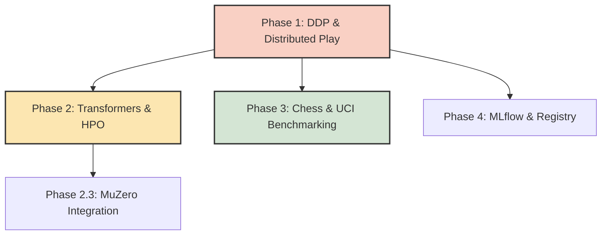

# Next-Steps Implementation Plan — 2026 H2

> **Implementation Progress (Updated 2026-07-23):**
> Phases 0–5 from the early H2 roadmap (tech debt cleanup, coverage baselining, Gradio UI, single-node GPU training, and ADK integration) have been **successfully implemented and merged**. The test suite stands at 10,142+ passing with 93.36% coverage. The `SelfPlayTrainer` and `UnifiedTrainingOrchestrator` are stable on single-GPU (AMP, `torch.compile`). 
> 
> **The roadmap below defines the new frontier for the remainder of H2 2026: Scaling, Advanced Architectures, and Enterprise Developer Experience.**

---

## 1. Why this plan exists

With the foundational MCTS architecture, GPU introspection, and testing gates stabilized, the `Strategos-MCTS` framework is ready to scale. This document sequences the next four major epics to transform the framework from a single-node prototype into a distributed, enterprise-grade AI training harness capable of handling complex domains (Chess, Go) and advanced representations (MuZero, Transformers).

### 1.1 Engineering Constraints (Non-Negotiable)

1. **Backward Compatibility:** No breaking changes to public signatures or the `DomainRegistry`. Single-GPU and CPU fallbacks must remain fully functional.
2. **Spec-Driven Development (SDD):** Every phase below must be preceded by a formal `/spec-new` and approved by the `spec-review` gate before PR submission.
3. **Pydantic Driven:** All new HPOs, scaling factors, and networking ports must flow through `SystemConfig` or `TrainingProfile`. No hardcoded values.
4. **Coverage Gate:** The `fail_under = 85.0` branch-coverage gate must stay green.

---

## 2. Phased Roadmap: The New Frontier

### Phase 1 — Scaling & Performance (Distributed Training) 🟢 IN PROGRESS (1.1 COMPLETE) · ~2 weeks
*Targeting maximum throughput and reduced wall-clock time for self-play loops.*

- **1.1 Distributed Data Parallel (DDP) [COMPLETED 2026-07-23]:** Integrated `torch.nn.parallel.DistributedDataParallel` (`src/utils/distributed.py`) for multi-GPU training with dynamic `torchrun` rank resolution, Rank-0 I/O fencing, and 100% test coverage.
- **1.2 Distributed Self-Play (MPI/RPC):** Decouple data generation from training. Build an asynchronous architecture where multiple worker nodes generate games (self-play) and push to a centralized replay buffer (Redis/gRPC), while a dedicated learner node continuously trains the model.
- **1.3 Inference Optimization:** Implement `.to_onnx()` or `.to_tensorrt()` exports for the `PolicyValueNetwork`. Utilize the compiled engine during MCTS rollouts to drastically reduce latency.

### Phase 2 — Architectural Evolutions 🟠 HIGH · ~3 weeks
*Pushing the envelope on representational capacity and sample efficiency.*

- **2.1 Transformer-based Encoders:** Implement a Vision Transformer (ViT) style architecture adapted for grid/board states. Integrate it so `PolicyValueNetwork` dynamically accepts either `"resnet"` or `"transformer"` backbones.
- **2.2 Hyperparameter Optimization (HPO):** Integrate Ray Tune. Add a `harness tune` command to autonomously search for optimal MCTS exploration constants ($c_{puct}$), learning rates, and temperature scaling.
- **2.3 MuZero Architecture Integration:** Evolve the AlphaZero-style architecture toward MuZero. Implement the Representation ($h$), Dynamics ($g$), and Prediction ($f$) networks, modifying the MCTS engine to search over learned hidden states.

### Phase 3 — Advanced Domains & Benchmarking 🟡 MEDIUM · ~2 weeks
*Stress-testing the framework with complex state spaces and imperfect information.*

- **3.1 Chess Integration:** Implement the complex $8 \times 8 \times 73$ action space encoding. Integrate `python-chess` for FEN/PGN parsing and move validation.
- **3.2 Automated Engine Evaluation:** Expand `src/benchmark/policy_comparison.py` with adapters for standard UCI protocols. Automate ELO rating calculations by pitting our checkpoints against Stockfish (Chess) or Edax (Othello).
- **3.3 Stochastic / Imperfect Info Domains:** Expand `DomainRegistry` to support stochastic environments (e.g., Backgammon, Poker) to test MCTS robustness under uncertainty (Information State MCTS).

### Phase 4 — Harness & Developer Experience 🟢 STANDARD · ~1 week
*Enterprise-grade observability and lifecycle management.*

- **4.1 Real-time Experiment Tracking:** Implement an `ExperimentTracker` wrapper for MLflow (or Weights & Biases) to log loss curves, ELO progression, win rates, and GPU utilization (`get_gpu_info()`) dynamically.
- **4.2 Model Registry & Checkpoint Lifecycle:** Build a structured registry into the CLI (`harness registry push`, `harness registry deploy`). Integrate with `graph_service.py` to allow hot-swapping of models with zero downtime.

---

## 3. Sequencing, Dependencies & Timeline

| Phase | Focus | Est. | Gate to next |
|---|---|---|---|
| 1 | Multi-node scaling & low-latency inference | 2wk | Distributed E2E test green |
| 2 | Advanced Neural Architectures | 3wk | Transformer parity tests pass |
| 3 | Chess & Automated ELO | 2wk | UCI adapter plays valid match |
| 4 | Enterprise Observability | 1wk | MLflow dashboard functional |

---

## 4. Execution Model (Subagents / Worktrees / MCPs)

- **Spec-Driven Execution:** Every Phase sub-item (e.g., 1.1) requires a dedicated `/spec-new` and `/spec-implement` loop.
- **Worktrees:** Phases requiring heavy dependency changes (e.g., adding `ray` for HPO, `mlflow` for tracking) must be implemented in isolated git worktrees.
- **Deep Research:** Leverage the new `/deep-research` command (implemented 2026-07-23) prior to drafting specs for complex mathematical implementations like MuZero (Phase 2.3) and Transformer spatial embeddings (Phase 2.1).

---

## 5. Success Metrics

| Metric | Target |
|---|---|
| Distributed Scaling Efficiency | >80% linear scaling up to 4 GPUs |
| Architecture Benchmarks | Transformer backbone matches ResNet ELO within fewer epochs |
| Code Coverage | Sustained ≥85% across all new modules |
| API Downtime | Zero downtime during Model Registry hot-swaps |
